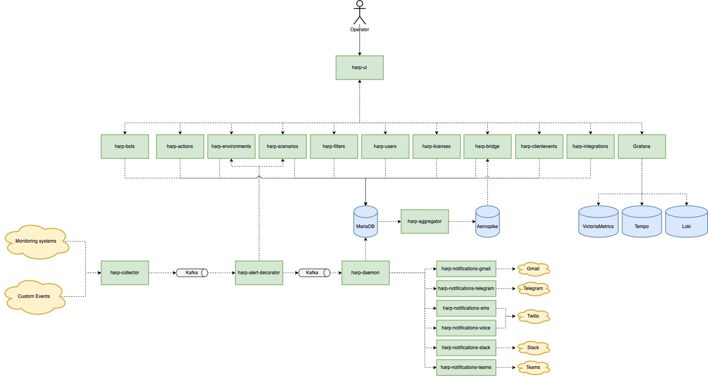

# Open Source Incident Management system

In our reality, with an existing speed of development and product requirements, we need to make sure that critical problems will be detected in time or even predict the issue and prevent it. Since it can cost millions of dollars, and you can lose your customers.

This platform provides the single place to detect -> investigate -> resolve your production incident

Platform collects events from different systems, allows to manage them in a single place and set the automation flow to make sure that event will be noticed and handled ASAP

- Website - https://harpia.io
- Documentation - https://docs.harpia.io/docs/intro
- Live Demo - [Check how it works](https://playground.harpia.io/#/login-?demo=true)
- Get it free - [Create account](https://registration.harpia.io/)

## How to Install

There are few options to install platform:
- [In SaaS](https://docs.harpia.io/docs/platform-installation#in-cloud-saas)
- [On a single server with docker compose](https://docs.harpia.io/docs/platform-installation#on-your-server)
- [In Kubernetes](https://docs.harpia.io/docs/platform-installation#in-kubernetes)

More details for each option you can find in our [documentation](https://docs.harpia.io/docs/platform-installation)

## How to collaborate
- **Email:** nikolay.k@harpia.io
- **Linkedin:** https://www.linkedin.com/in/the-harpia-io
- **GitHub Issue:** https://github.com/harpia-io/harpia/issues

## Roadmap

Official Roadmap 2023 you can find here - https://github.com/orgs/harpia-io/projects/1

## Platform Architecture

### Technical flow to process alerts
- [harp-collectors](https://github.com/harpia-io/harp-collectors): receive alerts from monitoring system, unify the structure and push them to Kafka topic
- [harp-alert-decorator](https://github.com/harpia-io/harp-alert-decorator): read alert from Kafka topic (produced by harp-collectors) and add additional info about environments and scenarios that should be applied to the alert
- [harp-daemon](https://github.com/the-harpia-io/harp-daemon): read alert from Kafka topic (produced by harp-alert-decorator), describe the logic and state of the alert and write result to MariaDB
- [harp-aggregator](https://github.com/harpia-io/harp-aggregator): read alerts from MariaDB, aggregate it and send to Aerospike
- [harp-bridge](https://github.com/harpia-io/harp-bridge): read alerts from Aerospike and send to UI via websockets
- [harp-ui](https://github.com/harpia-io/harp-ui): the main user interface of the platform

### Additional Services
- [harp-filters](https://github.com/harpia-io/harp-filters): create and manage the user specific filters in UI
- [harp-actions](https://github.com/harpia-io/harp-actions): manage alerts - handle, snooze, acknowledge
- [harp-environments](https://github.com/harpia-io/harp-environments): create and manage environments
- [harp-bots](https://github.com/harpia-io/harp-bots): configure your own bots to send auto notifications to different channels - Email, SMS, Slack etc..
- [harp-integrations](https://github.com/harpia-io/harp-integrations): create and manage the integrations with your monitoring systems
- [harp-licenses](https://github.com/harpia-io/harp-licenses): monitor the usage of the alerts and notification channels
- [harp-scenarios](https://github.com/harpia-io/harp-scenarios): create and manage scenarios for alerts
- [harp-users](https://github.com/harpia-io/harp-users): create and manage users inside platform including authentication and authorization
- [harp-notifications-gmail](https://github.com/harpia-io/harp-notifications-gmail): responsible to send auto email notifications
- [harp-notifications-msteams](https://github.com/harpia-io/harp-notifications-msteams): responsible to send auto notifications to Microsoft Teams
- [harp-notifications-slack](https://github.com/harpia-io/harp-notifications-slack): responsible to send auto notifications to Slack channel
- [harp-notifications-sms](https://github.com/harpia-io/harp-notifications-sms): responsible for creating auto SMS notifications via Twilio integration
- [harp-notifications-telegram](https://github.com/harpia-io/harp-notifications-telegram): responsible to send auto notifications to Telegram channels
- [harp-notifications-voice](https://github.com/harpia-io/harp-notifications-voice): responsible for creating auto Phone Calls via Twilio integration
- [harp-clientevents](https://github.com/harpia-io/harp-clientevents): receive and analyze metrics from the frontend

### Platform Monitoring
- Prometheus metrics in VictoriaMetrics
- Traces in Grafana Tempo
- Logs in Grafana Loki
- Dashboards and Alerts in Grafana